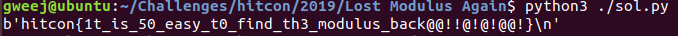

# Lost Modulus Again

## Challange

Consider the following class:

```python
class Key:
    def __init__(self, bits):
        assert bits >= 512
        self.p = getPrime(bits)
        self.q = getPrime(bits)
        self.n = self.p * self.q
        self.e = 0x100007
        self.d = inverse(self.e, (self.p-1)*(self.q-1))
        self.dmp1 = self.d%(self.p-1)
        self.dmq1 = self.d%(self.q-1)
        self.iqmp = inverse(self.q, self.p)
        self.ipmq = inverse(self.p, self.q)

    def encrypt(self, data):
        num = bytes_to_long(data)
        result = pow(num, self.e, self.n)
        return long_to_bytes(result)

    def decrypt(self, data):
        num = bytes_to_long(data)
        v1 = pow(num, self.dmp1, self.p)
        v2 = pow(num, self.dmq1, self.q)
        result = (v2*self.p*self.ipmq+v1*self.q*self.iqmp) % self.n
        return long_to_bytes(result)

    def __str__(self):
        return "Key([e = {0}, n = {1}, x = {2}, y = {3}])".format(self.e, self.d, self.iqmp, self.ipmq) # ???
```

Looks like a standard `RSA` impelemntation, nothing out of the ordinary in the key generation part... Wait whats this?

We can see that instead of getting `n`, we get `d`! we need to somehow recover `n` in order to decrypt the flag, since we already have `d`.

## Math

So we have the following information: `e`, `d=inv(e,(p-1)*(q-1))`, `p'=inv(p,q)` and `q'=inv(q,p)`.

From the definition of the modular inverse we know there are (positive) integers `k`, `t` and `s` such that:

1) `p' * p = 1 + kq`
2) `q' * q = 1 + tp`
3) `e * d = 1 + s * (p - 1) * (q - 1)`

Now for standard trick: `d` is roughly the size of `n` (most of the time), and so is `(p-1)*(q-1)`, so looking at equation 3, we know that `s` should be roughly the save size as `e`:

```
s = (e*d-1)/((p-1)*(q-1)) ~ (e*d)/((p-1)*(q-1)) ~ e
```

So we can brute `s in range(e - delta, e + delta)`, where `delta` isnt that big. We can check that `e*d - 1` is divisble by our guess for `s` to reduce the range even more.

Now its time for some annoying math. First of all, we can see that `(-t)*p =1-q'*q`, and therefore `-t` is also a modular inverse of `p mod q`, which means that `-t=p' (mod q)`. The same applies for `-k`, and we get the following interesting congruences:

4) `p' + t = i * q`
5) `q' + k = j * p`

for some positive integers `i`, `j`. I claim that actually, `i` = `j`.

Indeed, substituting `p'=i*q-t` in equation 1, we get:

```
p'*p = 1 + k*q
(i*q-t)*p = 1 + k*q
i*p*q - t*p = 1 + k*q
i*n = 1 + k*q + t*p
```

And similarly for `q'=j*p-k` in equation 2, we get: `j*n=1+k*q+t*p`, which means `j*n=i*n` and therefore `i=j`. We will denote the value of `i` and `j` as `l`.

Now we rewritten equations 4 and 5 as:

4) `p' + t = l * q`
5) `q' + k = l * p`

Now, `p'`, `q'`, `p` and `q` are around the same size, and so are `k` and `t` (using the same trick we user for `e` and `s`). Using that we get that:

```
l = (p' + t) / q ~ 2
```

That is, `l` is **really** small. So we can also brute force `l`, if we need too.

Now lets try substitution:

```
p'*p = 1 + k*q                  # Multiply by l
l*p'*p = l + k*q*l              # Substitute lp and lq as in equations 4 and 5
(q'+k)*p' = l + k(p'+t)         # Open up the brackets
p'*q' + k*p' = l + k*p' + k*t   # Move things around
p'*q' - l = k*t
```

That is interesting, since the left hand side is composed entirely of stuff we can compute.

Now for the real shit, lets try to use equation 3.

```
e*d - 1 = s*(p - 1)*(q - 1)                         # Divide by s
(e*d - 1) / s = (p - 1)*(q - 1)                     # Multiply by l^2
l^2 * [(e*d - 1) / s] = (l*p - l)*(l*q - l)         # Substitute equations 4,5
l^2 * [(e*d - 1) / s] = (q' + k - l)*(p' + t - l)   # Open up RHS

# Move stuff we know to LHS, and group stuff
LHS = q'*p' + q'*t - q'*l + k*p' + k*t - k*l - l*p' - l*t + l^2

# Write the final equation
LHS - q'*p' + l*(q'+p') - l^2 = (q'-l)*t + (p'-l)*k

l^2 * {[(e*d - 1) / s] - 1} - p'*q' - l*(p'+q') = (q'-l)*t + (p'-l)*k
```

Well. This sucks. But notice the LHS is composed entirely of stuff we know (or can brute force) and the right hand size is a linear equation in `t` and `k`, with known coefficients. If we call the monstrosity at the LHS `beta`, and set `alpha = p'*q' - l`, we have the have following equations:

6) `alpha = kt`
7) `beta = (p'-l)*k + (q'-l)*t`

Now, this system of equations is most definetly solvable (actually, its a quadratic equation!), which means we can recover `k` and `t` and then `p` and `q`. I wrote a short script that does exactly that, and lo and behold, it worked!


